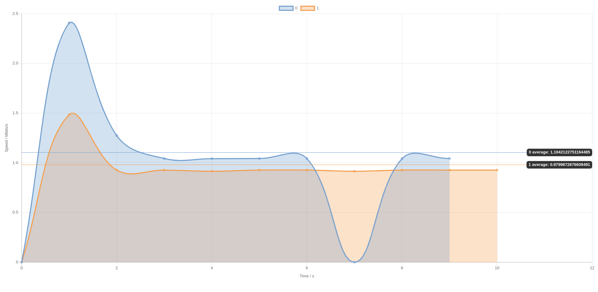

# vue-iperf3-chart

[](https://www.npmjs.com/package/vue-iperf3-chart)
[](https://www.npmjs.com/package/vue-iperf3-chart)
[](https://github.com/DCsunset/vue-iperf3-chart/blob/master/LICENSE)

A Vue component to plot iperf3 json data.

## Install

```
npm install vue-iperf3-chart
```

## Usage

First import the package and then use it as a Vue Component:

```html
<template>
	<div style="height: 95vh">
		<chart :data="jsonData" :options="options" />
	</div>
</template>

<script>
import jsonData from "./data.json";
import Chart from "./components/Chart.vue";

export default {
	name: "app",
	components: {
		Chart
	},
	data() {
		return {
			jsonData,
			options: {
				maintainAspectRatio: false
			}
		};
	}
};
</script>
```

The iperf3 chart's height and width depend on its parent node.
When the size of its parent node changes,
it changes as well.

## Props

| Prop    | Type   | Default     | Description                                       |
| ------- | ------ | ----------- | ------------------------------------------------- |
| data    | Object | `undefined` | iperf3 json data                                  |
| options | Object | `undefined` | options passed to Chart.js                        |
| unit    | String | `"Mbits"`   | The unit can be `"Kbits"`, `"Mbits"` or `"Gbits"` |


## Test

First clone this repository and install dependencies:

```
npm install
```

Then start the dev server to plot

```
npm run serve
```

Put the json data file in `src/data.json`.

Then change the options of Chart.js in `App.vue`
to have custom settings.


## Screenshot



## License

MIT License

